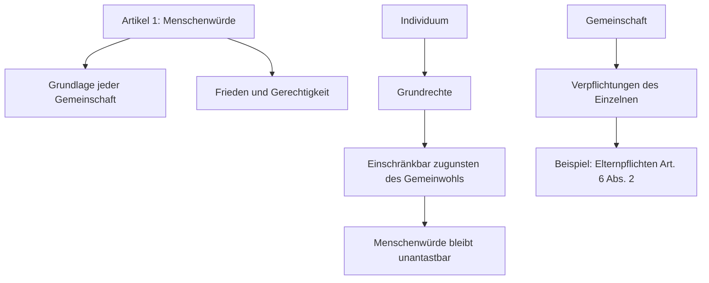

07:30–09:00 · WH · Raum 1.3.21 · HAR

Vortrag IPv6 - was ist das?

Vortrag IPv6 - wie werden diese erzeugt - (SLAAC)

Rechnen zu IPv6

Fragen zu IPv6 Klären

13:15–14:45 · PuG · Raum 1.3.19 · BRA

[Skript](https://3251.drive.bycs.de/external-bycs-office/share/Vorlage/PuG/2.%20Grundgesetz,%20Grundrechte/AB_Grundrechte.pdf?shareId=fe6c2188-1774-485d-ab89-c701419b6d71%243abfa5f1-9d00-4988-b4d0-cb5c5581816b%2189bc8ab1-aef9-4d6b-a001-1493fb4c92a7&fileId=fe6c2188-1774-485d-ab89-c701419b6d71%243abfa5f1-9d00-4988-b4d0-cb5c5581816b%2166fedf20-abe7-4a91-81f5-bb5401765b5d&contextRouteName=files-spaces-generic&contextRouteParams.driveAliasAndItem=share%2FVorlage%2FPuG%2F2.%20Grundgesetz%2C%20Grundrechte&contextRouteQuery.fileId=fe6c2188-1774-485d-ab89-c701419b6d71%243abfa5f1-9d00-4988-b4d0-cb5c5581816b%21ac414faf-b543-4506-a163-9ad87c4442fe&contextRouteQuery.shareId=fe6c2188-1774-485d-ab89-c701419b6d71%243abfa5f1-9d00-4988-b4d0-cb5c5581816b%2189bc8ab1-aef9-4d6b-a001-1493fb4c92a7&contextRouteQuery.sort-by=name&contextRouteQuery.sort-dir=asc) Aufgaben für Gruppe C

Aufgaben für Gruppe C

Informationen Seite 4

Aufgaben bearbeiten

Für Schnelle: Sammle informationenAllgemeine erklärung der menschrechte der UN von 1948 

Seite 4:

| Nr. | Fallbeispiel                                                        | GG-Artikel | MeRe | BüRe |
|----:|---------------------------------------------------------------------|-----------:|:----:|:----:|
| 1   | Medienvielfalt beruht auf Meinungs-, Informations- und Pressefreiheit. | Art. 5     | ✅   |      |
| 2   | Mann und Frau sind im Beruf und Privatleben gleichberechtigt.        | Art. 3     | ✅   |      |
| 3   | Aktives und passives Wahlrecht bedeuten politische Mitentscheidung.   | Art. 38    |      | ✅   |
| 4   | Ehe und Familie unterliegen einem besonderen Schutz.                  | Art. 6     | ✅   |      |
| 5   | Ausbildungs- und Arbeitsplatz können frei gewählt werden.            | Art. 12    | ✅   |      |

# Menschenbild des Grundgesetzes: Individuum und Gemeinschaft

# Das Menschenbild des Grundgesetzes: Individuum und Gemeinschaft

## Zentrale Grundlagen
- Die Würde des Menschen ist unantastbar (Art. 1 GG).
- Menschenrechte sind Grundlage jeder menschlichen Gemeinschaft, des Friedens und der Gerechtigkeit in der Welt.

## Der Einzelne als freies Individuum
- Das Grundgesetz schützt die persönliche Entfaltungsfreiheit (Art. 2 Abs. 1 GG).
- Der Mensch ist ein selbstbestimmtes, verantwortliches Subjekt.
- Jeder hat das Recht auf Autonomie in Lebensführung und Entscheidungen.

## Eingebunden in die Gemeinschaft
- Der Einzelne ist kein isoliertes Individuum, sondern in Gemeinschaft eingebunden.
- Einschränkungen der individuellen Freiheit sind erlaubt, wenn das Gemeinwohl es erfordert (z.B. Art. 6 Abs. 2: Elternpflichten).
- Grundrechte sind einschränkbar zugunsten des Gemeinwohls, wobei die Menschenwürde gewahrt bleiben muss.

## Verpflichtungen und Rechte im Zusammenspiel
- Gemeinschaft erfordert Verantwortung und Rücksichtnahme des Einzelnen.
- Der Staat schützt nicht nur Rechte, sondern setzt auch Pflichten und soziale Verantwortung voraus.
- Familienrechte und soziale Bindungen sind besonders geschützt (Art. 6 GG).

## Visualisierung der Spannungsbalance

# Das Menschenbild des Grundgesetzes: Individuum und Gemeinschaft

[ Menschenwürde (Art. 1) ]
          │
          ▼
┌─────────────────────┐
│     Individuum      │
│ - Persönliche Freiheit    │
│ - Selbstbestimmung        │
└─────────────────────┘
          │
 Einschränkungen nur wenn   
          │
          ▼
┌─────────────────────┐
│    Gemeinschaft     │
│ - Gemeinwohl Vorrang    │
│ - Soziale Verpflichtungen │
└─────────────────────┘
          │
          ▼
  Menschenwürde wahren
